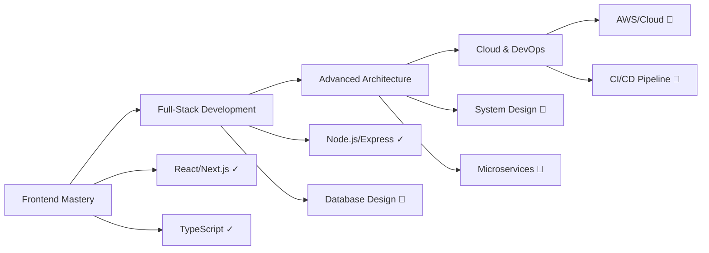

# 👋 Hello, I'm Arif Hossen

### Full-Stack Developer | TypeScript & Next.js Specialist

---

## 🚀 About Me

I'm a passionate full-stack developer specializing in modern web technologies. I focus on building scalable, user-centric applications with clean code and best practices. Currently expanding my expertise in TypeScript, Next.js, and system architecture.

- 🔭 **Currently working on:** Full-stack applications with Next.js and TypeScript
- 🌱 **Learning:** Python, Advanced System Design, and Cloud Architecture
- 💡 **Interests:** Open-source contribution, Web Performance, and Developer Experience
- 📍 **Location:** Dhaka, Bangladesh
- ⚡ **Fun fact:** I believe great code is like poetry—elegant and meaningful

---

## 🛠️ Technical Skills

### Frontend Development

### Backend Development

### Tools & Technologies

---

## 📊 GitHub Statistics

  

---

## 🎯 Featured Projects

| Project | Description | Technologies | Links |
|---------|-------------|--------------|-------|
| **Portfolio Website** | Modern, responsive portfolio showcasing my work and skills | Next.js, TypeScript, Tailwind CSS | [Live](https://arifprodev.vercel.app) • [Code](https://github.com/arifprodev/portfolio) |
| **Weather Dashboard** | Real-time weather application with location-based forecasts | React, OpenWeather API, CSS3 | [Live](https://weather.arifprodev.vercel.app) • [Code](https://github.com/arifprodev/weather-app) |
| **Blog Platform** | Full-featured blog with CMS integration and MDX support | Next.js, Sanity CMS, MDX | [Live](https://blog.arifprodev.vercel.app) • [Code](https://github.com/arifprodev/nextjs-blog) |

---

## 📈 Learning & Development Roadmap

**Legend:** ✓ Completed | 🔄 In Progress | 📝 Planned

---

## 💼 Professional Highlights

- ✨ Built **10+ production-ready** web applications
- 🎨 Proficient in creating **responsive and accessible** user interfaces
- ⚡ Focused on **performance optimization** and best practices
- 🤝 Active **open-source contributor** and community member
- 📚 Continuous learner keeping up with **latest web technologies**

---

## 📫 Let's Connect

---

### 💭 Quote of the Day

---

**"Code is like humor. When you have to explain it, it's bad."** – Cory House

---

**⭐ Thanks for visiting! Feel free to explore my repositories and don't forget to star the ones you find interesting!**

